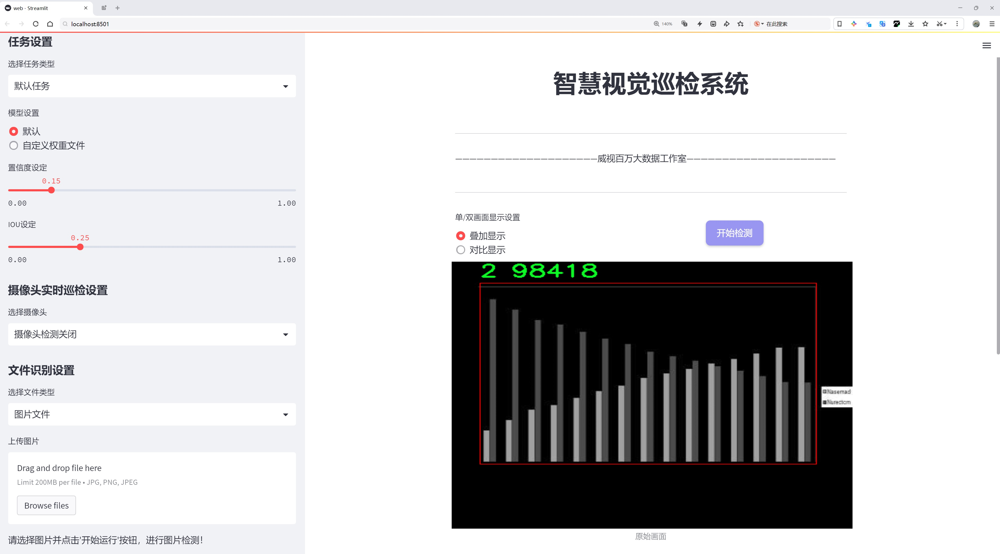
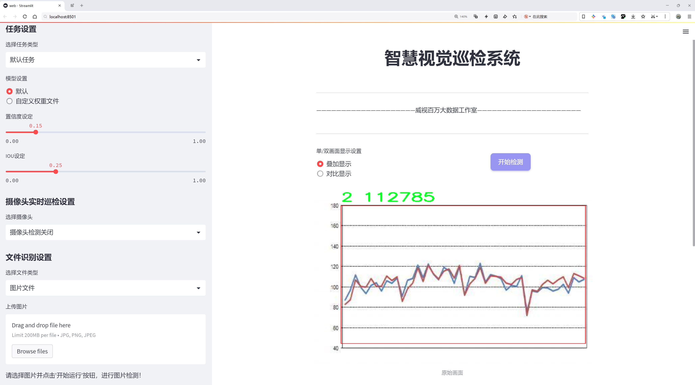
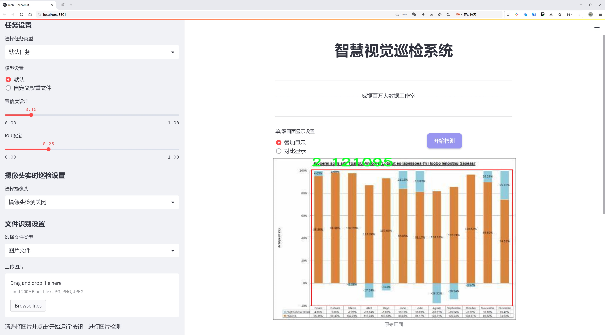
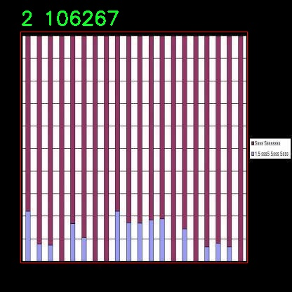
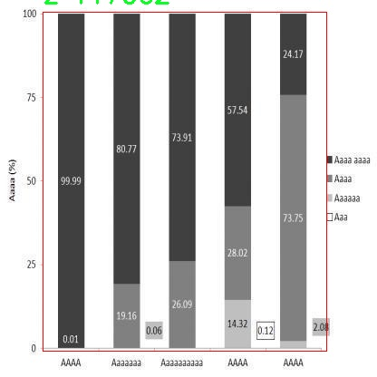
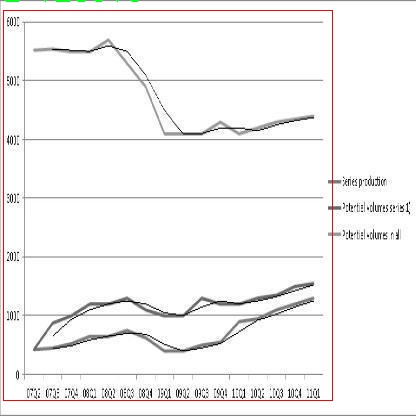
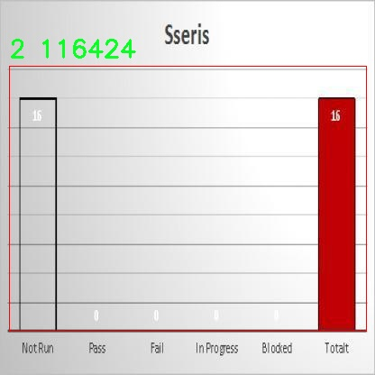
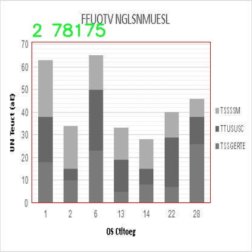

# 图表检测检测系统源码分享
 # [一条龙教学YOLOV8标注好的数据集一键训练_70+全套改进创新点发刊_Web前端展示]

### 1.研究背景与意义

项目参考[AAAI Association for the Advancement of Artificial Intelligence](https://gitee.com/qunshansj/projects)

项目来源[AACV Association for the Advancement of Computer Vision](https://gitee.com/qunmasj/projects)

研究背景与意义

随着信息技术的迅猛发展，图像处理和计算机视觉技术在各个领域的应用日益广泛，尤其是在广告监测、内容审核和智能识别等方面，图表检测系统的需求不断增加。传统的图表检测方法往往依赖于手工特征提取和规则定义，效率低下且适应性差，难以满足大规模数据处理的需求。因此，基于深度学习的目标检测技术逐渐成为研究的热点，其中YOLO（You Only Look Once）系列模型因其高效性和实时性受到广泛关注。

YOLOv8作为YOLO系列的最新版本，具备了更强的特征提取能力和更快的推理速度，适合于处理复杂的图像数据。在此背景下，基于改进YOLOv8的图表检测系统的研究显得尤为重要。该系统不仅能够实现对图表中信息的快速识别与分类，还能够在实际应用中提供更高的准确性和鲁棒性。通过对YOLOv8模型的改进，可以针对特定的图表类型和内容进行优化，从而提升检测性能。

本研究所使用的数据集包含3500张图像，涵盖了三类不同的图表类型。数据集的多样性为模型的训练和测试提供了丰富的样本，能够有效地提升模型的泛化能力。具体而言，数据集中每一类图表都代表了不同的信息表达方式，这为模型学习不同图表特征提供了基础。通过对这些图表进行标注和分类，研究者可以更深入地理解不同类型图表的结构和特征，从而为后续的模型改进提供依据。

在图表检测的实际应用中，准确识别和分类图表信息对于数据分析、市场研究和决策支持等领域具有重要意义。通过实现高效的图表检测系统，能够帮助企业和研究机构快速获取和分析大量数据，从而提升工作效率和决策质量。此外，随着社交媒体和在线广告的普及，图表内容的监测和审核变得愈发重要。基于改进YOLOv8的图表检测系统能够为广告合规性检查和内容审核提供技术支持，确保信息的准确传达和合法合规。

综上所述，基于改进YOLOv8的图表检测系统的研究不仅具有重要的理论价值，也具备广泛的实际应用前景。通过深入探索该领域的技术创新，能够推动计算机视觉技术在图表检测中的应用发展，为相关行业的数字化转型提供有力支持。同时，该研究也为后续的图像处理和目标检测技术的进步奠定了基础，具有重要的学术意义和社会价值。

### 2.图片演示







##### 注意：由于此博客编辑较早，上面“2.图片演示”和“3.视频演示”展示的系统图片或者视频可能为老版本，新版本在老版本的基础上升级如下：（实际效果以升级的新版本为准）

  （1）适配了YOLOV8的“目标检测”模型和“实例分割”模型，通过加载相应的权重（.pt）文件即可自适应加载模型。

  （2）支持“图片识别”、“视频识别”、“摄像头实时识别”三种识别模式。

  （3）支持“图片识别”、“视频识别”、“摄像头实时识别”三种识别结果保存导出，解决手动导出（容易卡顿出现爆内存）存在的问题，识别完自动保存结果并导出到tempDir中。

  （4）支持Web前端系统中的标题、背景图等自定义修改，后面提供修改教程。

  另外本项目提供训练的数据集和训练教程,暂不提供权重文件（best.pt）,需要您按照教程进行训练后实现图片演示和Web前端界面演示的效果。

### 3.视频演示

[3.1 视频演示](https://member.bilibili.com/platform/upload-manager/article)

### 4.数据集信息展示

##### 4.1 本项目数据集详细数据（类别数＆类别名）

nc: 3
names: ['0', '1', '2']


##### 4.2 本项目数据集信息介绍

数据集信息展示

在现代计算机视觉领域，图表检测技术的进步对于信息提取和数据分析具有重要意义。为此，我们采用了名为“aicheckads-addimg”的数据集，以支持对YOLOv8模型的改进和优化。该数据集专门设计用于图表检测任务，旨在提升模型在不同类型图表识别中的准确性和鲁棒性。

“aicheckads-addimg”数据集包含三种类别，分别标记为‘0’，‘1’和‘2’，这三类图表涵盖了常见的图表类型，如柱状图、饼图和折线图。每一类图表在数据集中都有丰富的样本，确保模型能够在多样化的场景中进行有效的学习。类别‘0’代表柱状图，通常用于展示不同类别之间的比较，数据集中的柱状图样本包括各种颜色和样式，确保模型能够适应不同的视觉表现形式。类别‘1’则是饼图，主要用于显示部分与整体之间的关系，数据集中包含了多种不同的饼图设计，涵盖了不同的分割方式和标签布局，以增强模型对饼图特征的识别能力。最后，类别‘2’代表折线图，广泛应用于时间序列数据的可视化，数据集中提供了多种折线图样本，涵盖了不同的线条风格和数据点标记，帮助模型学习如何准确识别趋势和变化。

该数据集的构建过程注重多样性和代表性，确保每个类别的样本不仅在数量上充足，而且在质量上也经过严格筛选。样本的多样性使得模型在训练过程中能够接触到不同的图表风格和格式，从而提高其泛化能力。数据集中的每个样本都附带了详细的标注信息，包括图表的类别、位置和边界框，这为模型的训练提供了坚实的基础。

在数据预处理阶段，我们对图像进行了标准化处理，以确保输入数据的一致性。同时，数据增强技术的应用也极大地丰富了训练样本的多样性，包括旋转、缩放、翻转等操作，这些都有效地提升了模型的鲁棒性，使其能够在面对不同的图表样式和环境条件时，依然保持高效的检测性能。

通过使用“aicheckads-addimg”数据集，我们期望在YOLOv8的基础上，构建一个更为精确和高效的图表检测系统。该系统不仅能够在实验室环境中表现出色，更希望在实际应用中展现出强大的适应能力，满足不同场景下的图表识别需求。随着数据集的不断优化和扩展，我们相信该系统将为数据分析、商业智能等领域提供更为强大的支持，推动图表检测技术的进一步发展。











### 5.全套项目环境部署视频教程（零基础手把手教学）

[5.1 环境部署教程链接（零基础手把手教学）](https://www.ixigua.com/7404473917358506534?logTag=c807d0cbc21c0ef59de5)


[5.2 安装Python虚拟环境创建和依赖库安装视频教程链接（零基础手把手教学）](https://www.ixigua.com/7404474678003106304?logTag=1f1041108cd1f708b01a)

### 6.手把手YOLOV8训练视频教程（零基础小白有手就能学会）

[6.1 手把手YOLOV8训练视频教程（零基础小白有手就能学会）](https://www.ixigua.com/7404477157818401292?logTag=d31a2dfd1983c9668658)

### 7.70+种全套YOLOV8创新点代码加载调参视频教程（一键加载写好的改进模型的配置文件）

[7.1 70+种全套YOLOV8创新点代码加载调参视频教程（一键加载写好的改进模型的配置文件）](https://www.ixigua.com/7404478314661806627?logTag=29066f8288e3f4eea3a4)

### 8.70+种全套YOLOV8创新点原理讲解（非科班也可以轻松写刊发刊，V10版本正在科研待更新）

由于篇幅限制，每个创新点的具体原理讲解就不一一展开，具体见下列网址中的创新点对应子项目的技术原理博客网址【Blog】：


[8.1 70+种全套YOLOV8创新点原理讲解链接](https://gitee.com/qunmasj/good)

### 9.系统功能展示（检测对象为举例，实际内容以本项目数据集为准）

图9.1.系统支持检测结果表格显示

  图9.2.系统支持置信度和IOU阈值手动调节

  图9.3.系统支持自定义加载权重文件best.pt(需要你通过步骤5中训练获得)

  图9.4.系统支持摄像头实时识别

  图9.5.系统支持图片识别

  图9.6.系统支持视频识别

  图9.7.系统支持识别结果文件自动保存

  图9.8.系统支持Excel导出检测结果数据


### 10.原始YOLOV8算法原理

原始YOLOv8算法原理

YOLOv8作为YOLO系列的最新版本，承载着前辈模型的精髓，同时引入了一系列创新与改进，旨在提升目标检测的性能与灵活性。该模型的架构由三个主要部分构成：Backbone、Neck和Head，每个部分在整体目标检测流程中发挥着至关重要的作用。

在特征提取方面，YOLOv8s采用了CSPDarknet（Cross Stage Partial Darknet）作为主干网络。CSPDarknet的设计理念是通过分割网络结构以增强特征的表达能力和梯度流动性。与YOLOv5相比，YOLOv8s将C3模块替换为C2f模块，这一变化不仅实现了网络的轻量化，还在不牺牲检测精度的前提下，提升了模型的特征提取能力。C2f模块的核心在于其双分支结构，输入特征图被分为两个分支，每个分支经过卷积层进行降维处理，同时引入了v8_C2fBottleneck层，进一步丰富了特征图的维度。这样的设计使得模型能够在不同的分支中获取多样化的特征信息，最终通过卷积层进行融合，形成高维特征图，从而增强了模型对复杂场景的适应能力。

在特征提取的深度与广度上，YOLOv8s引入了快速空间金字塔池化（SPPF）结构，以有效提取不同尺度的特征。SPPF通过在多个尺度上进行特征提取，能够显著减少模型的参数量和计算量，同时提升特征提取的效率。这一设计使得YOLOv8s在处理多尺度目标时表现出色，能够有效应对不同大小的目标检测任务。

YOLOv8s的目标检测部分则采用了特征金字塔网络（FPN）与路径聚合网络（PAN）的结合，形成了强大的Neck结构。该结构通过多个卷积层和池化层，对特征图进行处理与压缩，从而实现了多层次特征的有效融合。Neck的设计使得YOLOv8s能够在不同层次上捕捉到丰富的上下文信息，进一步提升了目标检测的准确性。

值得一提的是，YOLOv8s在检测方式上采用了无锚框（Anchor-Free）的策略，直接预测目标的中心点及其宽高比例。这一创新不仅减少了对Anchor框的依赖，还显著提高了检测速度和准确度。通过直接预测目标的几何信息，YOLOv8s能够更灵活地适应不同形状和大小的目标，进一步提升了模型的实用性。

在损失函数的设计上，YOLOv8s引入了VFLLoss作为分类损失，并结合DFLLoss与CIoULoss作为回归损失。这种损失函数的组合旨在解决样本不平衡的问题，尤其是在处理小目标时，能够有效提升模型的学习能力与收敛速度。此外，YOLOv8s采用了Task-Aligned的样本匹配策略，以动态调整样本的分配，提高了训练过程中的效率。

数据预处理方面，YOLOv8s延续了YOLOv5的策略，采用了包括马赛克增强、混合增强、空间扰动和颜色扰动等多种数据增强手段。这些增强技术的引入，旨在提升模型的泛化能力，使其在不同环境下均能保持良好的检测性能。

综上所述，YOLOv8s在原有YOLO系列的基础上，通过引入C2f模块、SPPF结构、无锚框检测方式及改进的损失函数等多项创新，极大地提升了目标检测的效率与准确性。其在特征提取、特征融合及目标检测等方面的改进，使得YOLOv8s不仅在理论上具有较高的价值，也在实际应用中展现出强大的能力，成为目标检测领域的重要里程碑。随着YOLOv8s的推出，目标检测技术在准确性、速度及灵活性等方面都迈上了一个新的台阶，为未来的研究与应用提供了更加坚实的基础。


### 11.项目核心源码讲解（再也不用担心看不懂代码逻辑）

#### 11.1 code\ultralytics\models\fastsam\val.py

以下是对代码的核心部分进行分析和详细注释的结果：

```python
# 引入必要的模块
from ultralytics.models.yolo.segment import SegmentationValidator
from ultralytics.utils.metrics import SegmentMetrics

class FastSAMValidator(SegmentationValidator):
    """
    自定义验证类，用于快速SAM（Segment Anything Model）分割，
    继承自Ultralytics YOLO框架中的SegmentationValidator类。
    
    此类专门定制了验证过程，设置任务为'segment'，并使用SegmentMetrics进行评估。
    此外，为了避免在验证过程中出现错误，禁用了绘图功能。
    """

    def __init__(self, dataloader=None, save_dir=None, pbar=None, args=None, _callbacks=None):
        """
        初始化FastSAMValidator类，设置任务为'segment'，并将指标设置为SegmentMetrics。

        参数：
            dataloader (torch.utils.data.DataLoader): 用于验证的数据加载器。
            save_dir (Path, optional): 保存结果的目录。
            pbar (tqdm.tqdm): 用于显示进度的进度条。
            args (SimpleNamespace): 验证器的配置。
            _callbacks (dict): 存储各种回调函数的字典。

        注意：
            此类禁用了ConfusionMatrix和其他相关指标的绘图，以避免错误。
        """
        # 调用父类的初始化方法
        super().__init__(dataloader, save_dir, pbar, args, _callbacks)
        
        # 设置任务类型为'segment'
        self.args.task = "segment"
        
        # 禁用绘图功能以避免错误
        self.args.plots = False
        
        # 初始化指标为SegmentMetrics
        self.metrics = SegmentMetrics(save_dir=self.save_dir, on_plot=self.on_plot)
```

### 代码分析
1. **类定义**: `FastSAMValidator` 继承自 `SegmentationValidator`，这是一个专门用于分割任务的验证器。
2. **构造函数**: `__init__` 方法初始化了验证器的基本参数，并设置任务类型为分割。
3. **参数说明**:
   - `dataloader`: 用于加载验证数据的对象。
   - `save_dir`: 指定结果保存的目录。
   - `pbar`: 显示验证进度的进度条。
   - `args`: 包含验证器配置的参数。
   - `_callbacks`: 存储回调函数的字典。
4. **功能禁用**: 为了避免在验证过程中出现错误，禁用了绘图功能。
5. **指标初始化**: 使用 `SegmentMetrics` 类来计算分割任务的评估指标。

这个类的设计目的是为了简化快速SAM模型的验证过程，并确保在评估时不会出现不必要的错误。

该文件定义了一个名为 `FastSAMValidator` 的类，继承自 `SegmentationValidator`，用于在 Ultralytics YOLO 框架中进行快速 SAM（Segment Anything Model）分割的自定义验证。该类的主要目的是定制验证过程，以适应快速 SAM 的需求。

在类的文档字符串中，简要说明了该类的功能和属性。它设置了任务为“分割”，并使用 `SegmentMetrics` 进行评估。此外，为了避免在验证过程中出现错误，该类禁用了绘图功能。

构造函数 `__init__` 初始化了 `FastSAMValidator` 类的实例。它接受多个参数，包括数据加载器 `dataloader`、结果保存目录 `save_dir`、进度条 `pbar`、配置参数 `args` 以及用于存储各种回调函数的字典 `_callbacks`。在初始化过程中，调用了父类的构造函数，并将任务类型设置为“segment”。同时，禁用了与混淆矩阵和其他相关指标的绘图功能，以避免可能的错误。最后，实例化了 `SegmentMetrics`，用于后续的性能评估。

总体而言，该文件的主要功能是提供一个定制的验证类，以便在快速 SAM 分割任务中使用，确保验证过程的顺利进行并避免不必要的错误。

#### 11.2 ui.py

```python
import sys
import subprocess

def run_script(script_path):
    """
    使用当前 Python 环境运行指定的脚本。

    Args:
        script_path (str): 要运行的脚本路径

    Returns:
        None
    """
    # 获取当前 Python 解释器的路径
    python_path = sys.executable

    # 构建运行命令，使用 streamlit 运行指定的脚本
    command = f'"{python_path}" -m streamlit run "{script_path}"'

    # 执行命令
    result = subprocess.run(command, shell=True)
    # 检查命令执行结果，如果返回码不为0，表示出错
    if result.returncode != 0:
        print("脚本运行出错。")


# 实例化并运行应用
if __name__ == "__main__":
    # 指定要运行的脚本路径
    script_path = "web.py"  # 这里可以替换为实际的脚本路径

    # 调用函数运行脚本
    run_script(script_path)
```

### 代码注释说明：
1. **导入模块**：
   - `sys`：用于获取当前 Python 解释器的路径。
   - `subprocess`：用于执行外部命令。

2. **`run_script` 函数**：
   - 接收一个参数 `script_path`，表示要运行的 Python 脚本的路径。
   - 使用 `sys.executable` 获取当前 Python 解释器的路径，以确保在当前环境中运行脚本。
   - 构建一个命令字符串，使用 `streamlit` 模块运行指定的脚本。
   - 使用 `subprocess.run` 执行构建的命令，并检查返回值以判断脚本是否成功运行。

3. **主程序块**：
   - 当脚本作为主程序运行时，指定要运行的脚本路径（这里是 `web.py`）。
   - 调用 `run_script` 函数来执行指定的脚本。

这个程序文件的主要功能是通过当前的 Python 环境来运行一个指定的脚本，具体来说是运行一个名为 `web.py` 的脚本。文件的开头导入了必要的模块，包括 `sys`、`os` 和 `subprocess`，其中 `sys` 用于访问与 Python 解释器相关的变量和函数，`subprocess` 用于执行外部命令。

在文件中定义了一个名为 `run_script` 的函数，该函数接受一个参数 `script_path`，表示要运行的脚本的路径。函数内部首先获取当前 Python 解释器的路径，接着构建一个命令字符串，该命令使用 `streamlit` 模块来运行指定的脚本。这里使用了 `-m` 选项来指定模块运行方式，并且将脚本路径用引号括起来，以处理路径中可能存在的空格。

然后，使用 `subprocess.run` 方法来执行构建好的命令。如果命令执行的返回码不为零，表示脚本运行过程中出现了错误，此时会打印出一条错误信息。

在文件的最后部分，使用 `if __name__ == "__main__":` 语句来确保当这个文件作为主程序运行时，以下代码才会被执行。这里指定了要运行的脚本路径为 `web.py`，并调用 `run_script` 函数来执行这个脚本。

总的来说，这个程序的目的是方便地通过当前 Python 环境来运行一个 Streamlit 应用脚本，并处理可能出现的错误。

#### 11.3 70+种YOLOv8算法改进源码大全和调试加载训练教程（非必要）\ultralytics\hub\utils.py

以下是经过简化和注释的核心代码部分：

```python
import os
import platform
import random
import sys
import threading
import time
from pathlib import Path
import requests
from ultralytics.utils import (ENVIRONMENT, LOGGER, ONLINE, RANK, SETTINGS, TESTS_RUNNING, TQDM, TryExcept, __version__,
                               colorstr, get_git_origin_url, is_colab, is_git_dir, is_pip_package)
from ultralytics.utils.downloads import GITHUB_ASSETS_NAMES

# 定义用于输出的前缀和帮助信息
PREFIX = colorstr('Ultralytics HUB: ')
HELP_MSG = '如果此问题持续存在，请访问 https://github.com/ultralytics/hub/issues 寻求帮助。'
HUB_API_ROOT = os.environ.get('ULTRALYTICS_HUB_API', 'https://api.ultralytics.com')
HUB_WEB_ROOT = os.environ.get('ULTRALYTICS_HUB_WEB', 'https://hub.ultralytics.com')

def smart_request(method, url, retry=3, timeout=30, thread=True, verbose=True, progress=False, **kwargs):
    """
    使用'requests'库进行HTTP请求，支持重试和超时设置。

    Args:
        method (str): 请求方法，例如'GET'或'POST'。
        url (str): 请求的URL。
        retry (int): 重试次数，默认为3。
        timeout (int): 超时时间（秒），默认为30。
        thread (bool): 是否在单独的线程中执行请求，默认为True。
        verbose (bool): 是否打印日志，默认为True。
        progress (bool): 是否显示进度条，默认为False。
        **kwargs (dict): 传递给requests函数的其他参数。

    Returns:
        (requests.Response): HTTP响应对象。
    """
    retry_codes = (408, 500)  # 仅在这些状态码下重试

    @TryExcept(verbose=verbose)
    def func(func_method, func_url, **func_kwargs):
        """执行HTTP请求，支持重试和超时。"""
        r = None  # 响应对象
        t0 = time.time()  # 记录开始时间
        for i in range(retry + 1):
            if (time.time() - t0) > timeout:  # 检查是否超时
                break
            r = requests.request(func_method, func_url, **func_kwargs)  # 执行请求
            if r.status_code < 300:  # 如果状态码在2xx范围内，表示成功
                break
            if i == 0 and verbose:
                LOGGER.warning(f'{PREFIX}请求失败，状态码: {r.status_code} {HELP_MSG}')
            time.sleep(2 ** i)  # 指数退避
        return r

    args = method, url
    if thread:
        threading.Thread(target=func, args=args, kwargs=kwargs, daemon=True).start()  # 在新线程中执行
    else:
        return func(*args, **kwargs)  # 在当前线程中执行

class Events:
    """
    用于收集匿名事件分析的类。事件分析在设置中sync=True时启用，sync=False时禁用。

    Attributes:
        url (str): 发送匿名事件的URL。
        rate_limit (float): 发送事件的速率限制（秒）。
        metadata (dict): 包含环境元数据的字典。
        enabled (bool): 根据某些条件启用或禁用事件。
    """

    url = 'https://www.google-analytics.com/mp/collect?measurement_id=G-X8NCJYTQXM&api_secret=QLQrATrNSwGRFRLE-cbHJw'

    def __init__(self):
        """初始化Events对象，设置默认值。"""
        self.events = []  # 事件列表
        self.rate_limit = 60.0  # 速率限制（秒）
        self.t = 0.0  # 速率限制计时器（秒）
        self.metadata = {
            'cli': Path(sys.argv[0]).name == 'yolo',
            'install': 'git' if is_git_dir() else 'pip' if is_pip_package() else 'other',
            'python': '.'.join(platform.python_version_tuple()[:2]),  # Python版本
            'version': __version__,
            'env': ENVIRONMENT,
            'session_id': round(random.random() * 1E15),  # 随机会话ID
            'engagement_time_msec': 1000}
        self.enabled = \
            SETTINGS['sync'] and \
            RANK in (-1, 0) and \
            not TESTS_RUNNING and \
            ONLINE and \
            (is_pip_package() or get_git_origin_url() == 'https://github.com/ultralytics/ultralytics.git')

    def __call__(self, cfg):
        """
        尝试将新事件添加到事件列表，并在达到速率限制时发送事件。

        Args:
            cfg (IterableSimpleNamespace): 包含模式和任务信息的配置对象。
        """
        if not self.enabled:
            return  # 如果事件被禁用，则不执行任何操作

        # 尝试添加事件
        if len(self.events) < 25:  # 事件列表限制为25个事件
            params = {
                **self.metadata, 'task': cfg.task,
                'model': cfg.model if cfg.model in GITHUB_ASSETS_NAMES else 'custom'}
            self.events.append({'name': cfg.mode, 'params': params})

        # 检查速率限制
        t = time.time()
        if (t - self.t) < self.rate_limit:
            return  # 如果在速率限制内，等待发送

        # 超过速率限制，立即发送
        data = {'client_id': SETTINGS['uuid'], 'events': self.events}  # 客户端ID和事件列表
        smart_request('post', self.url, json=data, retry=0, verbose=False)  # 发送POST请求

        # 重置事件和速率限制计时器
        self.events = []
        self.t = t

# 创建事件对象
events = Events()
```

### 代码说明：
1. **smart_request**：这是一个通用的HTTP请求函数，支持重试和超时机制。它会在请求失败时根据指定的状态码进行重试，并可以选择在新线程中执行请求。
  
2. **Events类**：用于收集和发送匿名事件分析数据。它在初始化时设置了元数据和启用条件，并提供了一个调用方法来添加事件并在达到速率限制时发送这些事件。

3. **速率限制**：Events类中实现了速率限制机制，确保在一定时间内不会发送过多的事件。

4. **请求和响应**：使用`requests`库进行HTTP请求，处理响应并根据状态码进行相应的操作。

这个程序文件是Ultralytics YOLO的一个工具模块，主要用于处理与Ultralytics HUB相关的请求和事件分析。代码首先导入了一些必要的库，包括操作系统、平台、随机数、线程、时间等模块，以及Ultralytics的工具函数和下载功能。

文件中定义了一些常量，例如HUB_API_ROOT和HUB_WEB_ROOT，这些常量分别表示Ultralytics HUB的API和网页根地址。接下来，定义了几个函数和一个类。

`request_with_credentials`函数用于在Google Colab环境中进行带有凭证的AJAX请求。它首先检查当前环境是否为Colab，如果不是，则抛出一个错误。然后，它使用JavaScript代码在Colab中发起请求，并返回响应数据。

`requests_with_progress`函数用于发起HTTP请求，并可选择性地显示下载进度条。该函数根据传入的HTTP方法和URL进行请求，如果设置了进度条，则会在下载过程中显示进度。

`smart_request`函数则是一个更为复杂的请求函数，它支持重试机制和超时设置。该函数可以在请求失败时进行多次重试，并且可以选择在后台线程中执行请求。它还支持显示进度条和记录请求状态，以便于调试和监控。

`Events`类用于收集匿名事件分析数据。该类的构造函数初始化了一些属性，包括事件列表、速率限制、元数据等。事件分析功能在特定条件下启用，例如在设置中同步选项为True时。类的`__call__`方法用于添加新事件到事件列表，并在达到速率限制时发送事件数据。

最后，代码在模块初始化时创建了一个`Events`类的实例，以便在后续操作中使用。整体来看，这个模块为YOLOv8的使用提供了网络请求和事件分析的基础功能，方便用户在使用过程中进行数据收集和问题排查。

#### 11.4 70+种YOLOv8算法改进源码大全和调试加载训练教程（非必要）\ultralytics\utils\files.py

以下是经过简化和注释的核心代码部分：

```python
import os
from pathlib import Path
from datetime import datetime

def increment_path(path, exist_ok=False, sep='', mkdir=False):
    """
    增加文件或目录路径的版本号，例如将 'runs/exp' 增加为 'runs/exp_2', 'runs/exp_3' 等。

    参数:
        path (str, pathlib.Path): 要增加的路径。
        exist_ok (bool, optional): 如果为 True，则返回原路径而不增加版本号。默认为 False。
        sep (str, optional): 路径与版本号之间的分隔符。默认为 ''。
        mkdir (bool, optional): 如果路径不存在，则创建该目录。默认为 False。

    返回:
        (pathlib.Path): 增加版本号后的路径。
    """
    path = Path(path)  # 将路径转换为 Path 对象，支持跨平台
    if path.exists() and not exist_ok:
        # 如果路径存在且不允许重复，则进行版本号增加
        path, suffix = (path.with_suffix(''), path.suffix) if path.is_file() else (path, '')

        # 尝试增加版本号
        for n in range(2, 9999):
            p = f'{path}{sep}{n}{suffix}'  # 生成新的路径
            if not os.path.exists(p):  # 如果新路径不存在，则使用该路径
                break
        path = Path(p)  # 更新路径为新生成的路径

    if mkdir:
        path.mkdir(parents=True, exist_ok=True)  # 如果需要，创建目录

    return path  # 返回增加版本号后的路径


def file_age(path):
    """返回文件自上次更新以来的天数。"""
    dt = (datetime.now() - datetime.fromtimestamp(Path(path).stat().st_mtime))  # 计算时间差
    return dt.days  # 返回天数


def file_size(path):
    """返回文件或目录的大小（以 MB 为单位）。"""
    if isinstance(path, (str, Path)):
        mb = 1 << 20  # 将字节转换为 MB (1024 ** 2)
        path = Path(path)
        if path.is_file():
            return path.stat().st_size / mb  # 返回文件大小
        elif path.is_dir():
            # 返回目录中所有文件的总大小
            return sum(f.stat().st_size for f in path.glob('**/*') if f.is_file()) / mb
    return 0.0  # 如果路径无效，返回 0.0
```

### 代码说明：
1. **increment_path**：该函数用于生成一个新的文件或目录路径，通过在原路径后添加一个递增的数字来避免路径冲突。可以选择是否创建该路径。
2. **file_age**：该函数计算并返回给定文件自上次修改以来的天数。
3. **file_size**：该函数计算并返回给定文件或目录的大小，支持返回目录中所有文件的总大小。

这个程序文件是一个用于处理文件和目录的工具类，主要用于Ultralytics YOLO项目中的文件管理。它包含了一些上下文管理器和函数，方便用户在不同的工作目录中进行操作，同时处理文件路径中的空格和文件增量命名等问题。

首先，`WorkingDirectory`类是一个上下文管理器，允许用户在指定的工作目录中执行代码。通过使用`@WorkingDirectory(dir)`装饰器或`with WorkingDirectory(dir):`语句，用户可以临时更改当前工作目录。进入上下文时，程序会将当前目录更改为指定的目录，退出时则恢复到原来的目录。

接下来，`spaces_in_path`函数是一个上下文管理器，用于处理路径中包含空格的情况。如果路径中有空格，它会将空格替换为下划线，并将文件或目录复制到新的临时路径中。在执行上下文代码块后，文件或目录会被复制回原来的位置。这对于在某些系统中处理路径时可能出现的问题非常有用。

`increment_path`函数用于生成一个增量的文件或目录路径。如果指定的路径已经存在，且`exist_ok`参数为False，函数会在路径后附加一个数字以避免冲突。用户可以指定分隔符和是否创建目录的选项。这个函数对于需要保存多个实验结果的场景非常实用。

`file_age`和`file_date`函数分别用于获取文件的最后修改时间。`file_age`返回自上次更新以来的天数，而`file_date`则返回一个可读的日期格式。这两个函数可以帮助用户了解文件的最新状态。

`file_size`函数用于计算文件或目录的大小，返回值为MB。如果传入的是文件路径，它会返回该文件的大小；如果是目录路径，则会计算该目录下所有文件的总大小。

最后，`get_latest_run`函数用于查找指定目录下最新的`last.pt`文件，通常用于恢复训练。它会递归搜索指定目录，并返回最新文件的路径。

总体来说，这个文件提供了一系列实用的工具函数和上下文管理器，帮助用户在YOLO项目中更方便地管理文件和目录，处理路径问题，提高工作效率。

#### 11.5 code\ultralytics\utils\patches.py

以下是代码中最核心的部分，并附上详细的中文注释：

```python
import cv2
import numpy as np
import torch

# 读取图像文件的函数
def imread(filename: str, flags: int = cv2.IMREAD_COLOR):
    """
    从文件中读取图像。

    参数:
        filename (str): 要读取的文件路径。
        flags (int, optional): 读取标志，默认为 cv2.IMREAD_COLOR。

    返回:
        (np.ndarray): 读取的图像。
    """
    # 使用 cv2.imdecode 从文件中读取图像，并返回为 numpy 数组
    return cv2.imdecode(np.fromfile(filename, np.uint8), flags)

# 保存图像文件的函数
def imwrite(filename: str, img: np.ndarray, params=None):
    """
    将图像写入文件。

    参数:
        filename (str): 要写入的文件路径。
        img (np.ndarray): 要写入的图像。
        params (list of ints, optional): 额外参数，参见 OpenCV 文档。

    返回:
        (bool): 如果文件写入成功返回 True，否则返回 False。
    """
    try:
        # 使用 cv2.imencode 将图像编码并写入文件
        cv2.imencode(Path(filename).suffix, img, params)[1].tofile(filename)
        return True
    except Exception:
        return False

# PyTorch 保存模型的函数
def torch_save(*args, **kwargs):
    """
    使用 dill（如果存在）序列化 lambda 函数，以解决 pickle 无法处理的情况。
    还增加了 3 次重试，使用指数退避算法，以提高对瞬时问题的鲁棒性。

    参数:
        *args (tuple): 传递给 torch.save 的位置参数。
        **kwargs (dict): 传递给 torch.save 的关键字参数。
    """
    try:
        import dill as pickle  # 尝试导入 dill 模块
    except ImportError:
        import pickle  # 如果没有，则使用 pickle

    if "pickle_module" not in kwargs:
        kwargs["pickle_module"] = pickle  # 设置 pickle 模块

    for i in range(4):  # 尝试 3 次重试
        try:
            return torch.save(*args, **kwargs)  # 调用原始的 torch.save 函数
        except RuntimeError:  # 如果保存失败，可能是设备未准备好或防病毒软件正在扫描
            if i == 3:
                raise  # 如果是最后一次重试，则抛出异常
            time.sleep((2**i) / 2)  # 指数退避，等待 0.5s, 1.0s, 2.0s
```

### 代码核心部分说明：
1. **imread**: 读取图像文件并返回为 NumPy 数组，支持多种读取标志。
2. **imwrite**: 将 NumPy 数组图像写入文件，处理可能的异常情况。
3. **torch_save**: 封装 PyTorch 的保存功能，支持使用 `dill` 序列化并实现重试机制，增强了保存操作的鲁棒性。

这个程序文件是一个用于扩展和更新现有功能的“猴子补丁”模块，主要涉及图像处理和模型保存的功能。文件中导入了多个库，包括OpenCV、NumPy和PyTorch，提供了一些自定义的图像读取、写入和显示函数，以及一个增强的模型保存函数。

首先，文件定义了一个自定义的`imread`函数，用于从文件中读取图像。这个函数接收文件名和标志参数，使用OpenCV的`imdecode`方法来读取图像数据，并返回一个NumPy数组。这样做的好处是能够处理多种文件格式，并且支持中文路径。

接着，定义了一个`imwrite`函数，用于将图像写入文件。该函数接收文件名、图像数据和可选的参数列表。它使用OpenCV的`imencode`方法将图像编码为指定格式，并将结果写入文件。异常处理机制确保在写入失败时返回`False`，从而提高了程序的健壮性。

此外，文件中还定义了一个`imshow`函数，用于在指定窗口中显示图像。该函数使用了一个编码和解码的技巧，以支持多语言窗口名称，确保在不同的操作系统和环境中都能正常显示。

在PyTorch相关的部分，文件定义了一个`torch_save`函数，增强了模型保存的功能。这个函数使用`dill`库（如果可用）来序列化那些`pickle`无法处理的lambda函数，并实现了重试机制，以应对临时性的问题，比如设备未准备好或防病毒软件正在扫描。函数中设置了最多三次重试，每次重试之间有指数退避的延迟，以提高保存操作的成功率。

总体来说，这个文件通过对OpenCV和PyTorch的功能进行扩展和增强，提供了更灵活和可靠的图像处理和模型保存方法，适用于Ultralytics YOLO项目中的相关需求。

#### 11.6 train.py

以下是代码中最核心的部分，并附上详细的中文注释：

```python
class DetectionTrainer(BaseTrainer):
    """
    DetectionTrainer类，继承自BaseTrainer类，用于基于检测模型的训练。
    """

    def build_dataset(self, img_path, mode="train", batch=None):
        """
        构建YOLO数据集。

        参数:
            img_path (str): 包含图像的文件夹路径。
            mode (str): 模式，可以是'train'或'val'，用户可以为每种模式自定义不同的增强。
            batch (int, optional): 批次大小，仅用于'rect'模式。默认为None。
        """
        gs = max(int(de_parallel(self.model).stride.max() if self.model else 0), 32)
        return build_yolo_dataset(self.args, img_path, batch, self.data, mode=mode, rect=mode == "val", stride=gs)

    def get_dataloader(self, dataset_path, batch_size=16, rank=0, mode="train"):
        """构造并返回数据加载器。"""
        assert mode in ["train", "val"]  # 确保模式有效
        with torch_distributed_zero_first(rank):  # 仅在DDP情况下初始化数据集*.cache一次
            dataset = self.build_dataset(dataset_path, mode, batch_size)  # 构建数据集
        shuffle = mode == "train"  # 训练模式下打乱数据
        if getattr(dataset, "rect", False) and shuffle:
            LOGGER.warning("WARNING ⚠️ 'rect=True'与DataLoader的shuffle不兼容，设置shuffle=False")
            shuffle = False  # 如果是rect模式，禁用shuffle
        workers = self.args.workers if mode == "train" else self.args.workers * 2  # 设置工作线程数
        return build_dataloader(dataset, batch_size, workers, shuffle, rank)  # 返回数据加载器

    def preprocess_batch(self, batch):
        """对一批图像进行预处理，包括缩放和转换为浮点数。"""
        batch["img"] = batch["img"].to(self.device, non_blocking=True).float() / 255  # 将图像转换为浮点数并归一化
        if self.args.multi_scale:  # 如果启用多尺度
            imgs = batch["img"]
            sz = (
                random.randrange(self.args.imgsz * 0.5, self.args.imgsz * 1.5 + self.stride)
                // self.stride
                * self.stride
            )  # 随机选择新的尺寸
            sf = sz / max(imgs.shape[2:])  # 计算缩放因子
            if sf != 1:  # 如果缩放因子不为1
                ns = [
                    math.ceil(x * sf / self.stride) * self.stride for x in imgs.shape[2:]
                ]  # 计算新的形状
                imgs = nn.functional.interpolate(imgs, size=ns, mode="bilinear", align_corners=False)  # 进行插值缩放
            batch["img"] = imgs  # 更新图像
        return batch  # 返回处理后的批次

    def get_model(self, cfg=None, weights=None, verbose=True):
        """返回YOLO检测模型。"""
        model = DetectionModel(cfg, nc=self.data["nc"], verbose=verbose and RANK == -1)  # 创建检测模型
        if weights:
            model.load(weights)  # 加载权重
        return model  # 返回模型

    def get_validator(self):
        """返回YOLO模型验证器。"""
        self.loss_names = "box_loss", "cls_loss", "dfl_loss"  # 定义损失名称
        return yolo.detect.DetectionValidator(
            self.test_loader, save_dir=self.save_dir, args=copy(self.args), _callbacks=self.callbacks
        )  # 返回验证器

    def plot_training_samples(self, batch, ni):
        """绘制带有注释的训练样本。"""
        plot_images(
            images=batch["img"],
            batch_idx=batch["batch_idx"],
            cls=batch["cls"].squeeze(-1),
            bboxes=batch["bboxes"],
            paths=batch["im_file"],
            fname=self.save_dir / f"train_batch{ni}.jpg",
            on_plot=self.on_plot,
        )  # 绘制图像

    def plot_metrics(self):
        """从CSV文件绘制指标。"""
        plot_results(file=self.csv, on_plot=self.on_plot)  # 保存结果图像
```

### 代码核心部分解释：
1. **DetectionTrainer类**：这是一个用于训练YOLO检测模型的类，继承自BaseTrainer类，包含了数据集构建、数据加载、模型获取、预处理等方法。
2. **build_dataset方法**：根据输入的图像路径和模式构建YOLO数据集，支持训练和验证模式。
3. **get_dataloader方法**：构建数据加载器，负责加载数据集并设置相关参数，如批次大小和工作线程数。
4. **preprocess_batch方法**：对输入的图像批次进行预处理，包括归一化和可能的缩放。
5. **get_model方法**：创建并返回YOLO检测模型，可以选择加载预训练权重。
6. **get_validator方法**：返回用于验证模型性能的验证器。
7. **plot_training_samples和plot_metrics方法**：用于可视化训练样本和训练过程中的指标。

这个程序文件 `train.py` 是一个用于训练目标检测模型的代码，主要基于 YOLO（You Only Look Once）架构。代码中定义了一个名为 `DetectionTrainer` 的类，该类继承自 `BaseTrainer`，用于处理与目标检测相关的训练过程。

在这个类中，首先定义了一个 `build_dataset` 方法，用于构建 YOLO 数据集。该方法接收图像路径、模式（训练或验证）和批次大小作为参数。它通过调用 `build_yolo_dataset` 函数来创建数据集，并根据模型的步幅（stride）进行调整。

接下来，`get_dataloader` 方法用于构建和返回数据加载器。它确保在分布式训练中只初始化一次数据集，并根据模式决定是否打乱数据。该方法还根据模式设置工作线程的数量。

`preprocess_batch` 方法负责对图像批次进行预处理，包括缩放和转换为浮点数格式。它支持多尺度训练，通过随机选择图像大小并进行插值处理来实现。

`set_model_attributes` 方法用于设置模型的属性，包括类别数量和类别名称。这些信息是从数据集中提取的，以确保模型能够正确处理特定的任务。

`get_model` 方法返回一个 YOLO 检测模型，并可以加载预训练权重。`get_validator` 方法则返回一个用于模型验证的 `DetectionValidator` 实例。

`label_loss_items` 方法用于返回带有标签的训练损失项字典，这对于目标检测任务是必要的。`progress_string` 方法返回一个格式化的字符串，显示训练进度，包括当前的轮次、GPU 内存使用情况和损失值。

此外，`plot_training_samples` 方法用于绘制训练样本及其注释，`plot_metrics` 方法用于从 CSV 文件中绘制训练指标，`plot_training_labels` 方法则创建一个带标签的训练图，展示模型的预测结果。

整体来看，这个文件实现了一个完整的目标检测训练流程，包括数据集构建、数据加载、模型设置、训练过程中的损失记录以及结果可视化等功能。

### 12.系统整体结构（节选）

### 整体功能和构架概括

该项目是一个基于YOLO（You Only Look Once）架构的目标检测和图像分割系统，包含多个模块和工具，旨在提供高效的模型训练、验证和推理功能。项目的结构清晰，主要分为以下几个部分：

1. **模型定义与训练**：包括目标检测和图像分割模型的定义、训练和验证过程。
2. **数据处理**：提供数据集构建、数据加载和预处理的功能，确保模型能够接收正确格式的数据。
3. **工具函数**：包含文件管理、图像处理、网络请求等实用工具，方便用户在训练和推理过程中进行各种操作。
4. **可视化**：支持训练过程中的损失记录和结果可视化，帮助用户监控模型性能。
5. **扩展性**：通过猴子补丁和其他方法，允许用户根据需要扩展和修改现有功能。

### 文件功能整理表

| 文件路径                                                                                       | 功能描述                                                                                       |
|-----------------------------------------------------------------------------------------------|-----------------------------------------------------------------------------------------------|
| `code\ultralytics\models\fastsam\val.py`                                                     | 定义 `FastSAMValidator` 类，用于快速SAM分割任务的验证过程。                                   |
| `ui.py`                                                                                       | 提供一个运行指定脚本（如 `web.py`）的功能，方便用户启动Streamlit应用。                       |
| `70+种YOLOv8算法改进源码大全和调试加载训练教程（非必要）\ultralytics\hub\utils.py`           | 提供网络请求和事件分析的工具，支持AJAX请求和HTTP请求的进度显示。                             |
| `70+种YOLOv8算法改进源码大全和调试加载训练教程（非必要）\ultralytics\utils\files.py`       | 提供文件和目录管理的工具，包括工作目录管理、增量路径生成、文件大小和日期获取等功能。         |
| `code\ultralytics\utils\patches.py`                                                          | 扩展OpenCV和PyTorch的功能，提供图像读取、写入和显示，以及增强的模型保存功能。                 |
| `train.py`                                                                                    | 定义 `DetectionTrainer` 类，负责目标检测模型的训练过程，包括数据集构建、模型设置和损失记录。 |
| `code\ultralytics\models\utils\__init__.py`                                                 | 初始化模型相关的工具模块，可能包含模型的加载和配置功能。                                     |
| `70+种YOLOv8算法改进源码大全和调试加载训练教程（非必要）\ultralytics\utils\patches.py`       | （与上面相同，可能是重复文件）提供图像处理和模型保存的增强功能。                             |
| `70+种YOLOv8算法改进源码大全和调试加载训练教程（非必要）\ultralytics\models\yolo\pose\train.py` | 负责YOLO姿态估计模型的训练过程，可能包括数据集构建和模型训练逻辑。                           |
| `code\ultralytics\utils\downloads.py`                                                        | 提供文件下载功能，支持从网络获取模型权重或数据集。                                           |
| `code\ultralytics\utils\tuner.py`                                                            | 提供模型超参数调优的功能，可能包括搜索最佳超参数的算法和方法。                               |
| `code\ultralytics\models\sam\modules\encoders.py`                                            | 定义图像分割模型的编码器模块，负责特征提取和数据编码。                                       |
| `code\ultralytics\solutions\speed_estimation.py`                                             | 提供速度估计的解决方案，可能包括对视频流或图像序列的处理。                                   |

以上表格总结了项目中各个文件的主要功能，展示了其在整体架构中的作用。通过这些模块的协同工作，用户可以高效地进行目标检测和图像分割任务。

注意：由于此博客编辑较早，上面“11.项目核心源码讲解（再也不用担心看不懂代码逻辑）”中部分代码可能会优化升级，仅供参考学习，完整“训练源码”、“Web前端界面”和“70+种创新点源码”以“13.完整训练+Web前端界面+70+种创新点源码、数据集获取”的内容为准。

### 13.完整训练+Web前端界面+70+种创新点源码、数据集获取


# [下载链接：https://mbd.pub/o/bread/ZpuTl5lp](https://mbd.pub/o/bread/ZpuTl5lp)